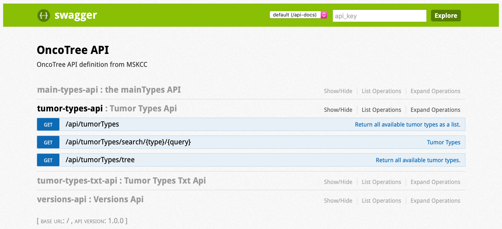
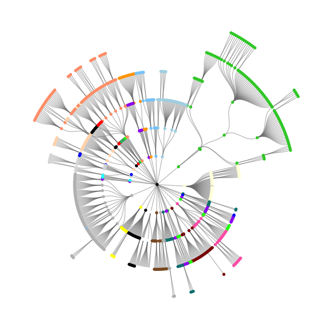
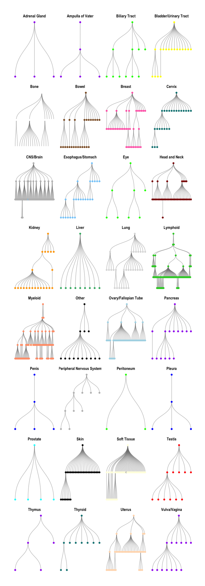
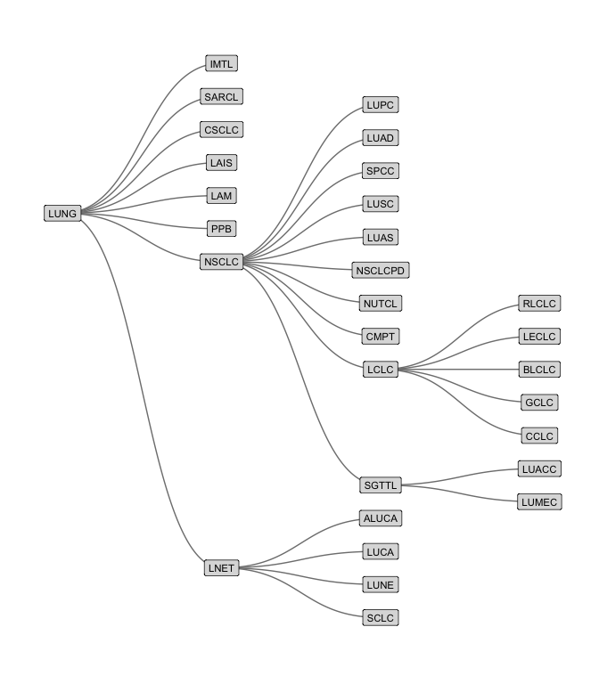

## Introduction

Cancers are often first classified by their tissue of origin, but there
are several types of cancer for each tissue. Further, each of these can
have several subdivisions. For example, head and neck cancers can be
further divided into seven cancers, including head and neck squamous
cell carcinoma (HNSC). HNSC itself has six subtypes, too. This hierarchy
can be represented in a directed acyclic graph (DAG), as shown below.


The [OncoTree](http://oncotree.mskcc.org/#/home) is a DAG of cancer
subtypes maintained by one of the leading cancer research institutes,
[Memorial Sloan Kettering](https://www.mskcc.org) (MSK).

For one of my projects in [lab](https://www.haigislab.org), I am dealing
with many types of cancers from a variety of studies. Thus, I want to
use OncoTree to organize the types and provide relational information of
the cancers. For instance, depending on what I want to analyze, I may
want the most specific subtype of cancer possible, or maybe I want the
cancer grouped by their first level on the OncoTree (e.g. “Head and
Neck”).

Therefore, I decided to parse the OncoTree into a
[‘tidygraph’](https://cran.r-project.org/web/packages/tidygraph/index.html),
a “tidy” way to manage graph structures. The following is a tutorial on
how I did this. The GitHub repository for this analysis is available at
[jhrcook/tidygraph-oncotree](https://github.com/jhrcook/tidygraph-oncotree).

## Setup

I will load the packages ‘tidyverse’, ‘tidygraph’, and ‘ggraph’, and
also use ‘httr’ and ‘jsonlite’, but call functions directly from their
namespace. The ‘ggraph’ package is a “grammar of graphics” for graph
structures - it is used for plotting graphs at the end of this tutorial.

``` r
library(ggraph)
```

    #> Loading required package: ggplot2

``` r
library(tidygraph)
```

    #> 
    #> Attaching package: 'tidygraph'

    #> The following object is masked from 'package:stats':
    #> 
    #>     filter

``` r
library(tidyverse)
```

    #> ── Attaching packages ─────────────────────────────────────────────────────── tidyverse 1.2.1 ──

    #> ✔ tibble  2.1.3     ✔ purrr   0.3.3
    #> ✔ tidyr   1.0.0     ✔ dplyr   0.8.3
    #> ✔ readr   1.3.1     ✔ stringr 1.4.0
    #> ✔ tibble  2.1.3     ✔ forcats 0.4.0

    #> ── Conflicts ────────────────────────────────────────────────────────── tidyverse_conflicts() ──
    #> ✖ dplyr::filter() masks tidygraph::filter(), stats::filter()
    #> ✖ dplyr::lag()    masks stats::lag()

## Sending requests to OncoTree’s API

The OncoTree has a fairly simple API (shown below). We are interested in
acquiring the full tree so we will use the “/api/tumorTypes/tree”
endpoint.



We can use the package
[‘httr’](https://cran.r-project.org/web/packages/httr/index.html) to
send a “get” request to the OncoTree API. Checking the status code
indicates how the request went, 200 representing success.

``` r
oncotree_res <- httr::GET("http://oncotree.mskcc.org/api/tumorTypes/tree")
oncotree_res$status_code
```

    #> [1] 200

The request returns a list of lists containing meta data on the request
and the actual OncoTree data.

``` r
httr::headers(oncotree_res)
```

    #> $date
    #> [1] "Mon, 16 Mar 2020 12:50:23 GMT"
    #> 
    #> $server
    #> [1] "Apache/2.2.15 (CentOS) mod_jk/1.2.41 mod_ssl/2.2.15 OpenSSL/1.0.1e-fips"
    #> 
    #> $`x-frame-options`
    #> [1] "SAMEORIGIN"
    #> 
    #> $vary
    #> [1] "Accept-Encoding"
    #> 
    #> $`content-encoding`
    #> [1] "gzip"
    #> 
    #> $connection
    #> [1] "close"
    #> 
    #> $`transfer-encoding`
    #> [1] "chunked"
    #> 
    #> $`content-type`
    #> [1] "application/json;charset=UTF-8"
    #> 
    #> attr(,"class")
    #> [1] "insensitive" "list"

The OncoTree data is a JSON in the `content` list of the response. In
case you want this data for other projects, the JSON can be written to
file using the `write()` function.

``` r
write(rawToChar(oncotree_res$content), file.path("oncotree.json"))
```

## Parsing the OncoTree JSON

The OncoTree is organized as a highly nested list. To get insight into
the structure we must turn the JSON into a list of lists so we can parse
it in R.

``` r
oncotree_json <- jsonlite::fromJSON(rawToChar(oncotree_res$content))
```

From here, I just played around with the list until I got an
understanding of the structure.

``` r
names(oncotree_json)
```

    #> [1] "TISSUE"

``` r
names(oncotree_json$TISSUE)
```

    #>  [1] "code"               "color"              "name"              
    #>  [4] "mainType"           "externalReferences" "tissue"            
    #>  [7] "children"           "parent"             "history"           
    #> [10] "level"              "revocations"        "precursors"

``` r
oncotree_json$TISSUE$code
```

    #> [1] "TISSUE"

``` r
oncotree_json$TISSUE$name
```

    #> [1] "Tissue"

``` r
oncotree_json$TISSUE$level
```

    #> [1] 0

Almost all of the parts of `oncotree_json$TISSUE` contain information
about the first level of the graph. The `children` section, though,
contains all of the tissues that we can see on the OncoTree web
application.

``` r
names(oncotree_json$TISSUE$children)
```

    #>  [1] "OVARY"            "LYMPH"            "SOFT_TISSUE"      "THYROID"         
    #>  [5] "PLEURA"           "PANCREAS"         "BILIARY_TRACT"    "BREAST"          
    #>  [9] "HEAD_NECK"        "EYE"              "AMPULLA_OF_VATER" "THYMUS"          
    #> [13] "CERVIX"           "PNS"              "BOWEL"            "BONE"            
    #> [17] "SKIN"             "BLADDER"          "BRAIN"            "ADRENAL_GLAND"   
    #> [21] "PROSTATE"         "LUNG"             "PENIS"            "UTERUS"          
    #> [25] "OTHER"            "TESTIS"           "LIVER"            "PERITONEUM"      
    #> [29] "MYELOID"          "VULVA"            "KIDNEY"           "STOMACH"

Each of these children “nodes” had the same information, and children of
their own, and so on.

``` r
names(oncotree_json$TISSUE$children$HEAD_NECK)
```

    #>  [1] "code"               "color"              "name"              
    #>  [4] "mainType"           "externalReferences" "tissue"            
    #>  [7] "children"           "parent"             "history"           
    #> [10] "level"              "revocations"        "precursors"

``` r
names(oncotree_json$TISSUE$children$HEAD_NECK$children)
```

    #> [1] "NPC"    "HNMUCM" "PTH"    "HNSC"   "OHNCA"  "SACA"   "SBL"

Therefore, we can tell that the JSON is a nested list of the nodes in
the DAG. And all we need to do is implement a graph-traversing function
to extract all of the information. Since it is nested and we are
building a graph, this strongly suggests we will need a recursive
algorithm.

## Building the Tidygraph

### Data needed for the tidygraph

To figure out what to do first, I often find it helpful to figure out
what my output should look like. To make a `tidygraph`, I will need an
*edge list* and a *node list*. The first is a two-column table with
names “from” and “to” populated by names of the nodes where each row
indicates an edge of the graph. The node list is optional and contains
any other information about each node, one row per node.

Here is a mock example of the data frames we want out of our recursive
algorithm.

``` r
# edge list
edge_list <- tibble::tribble(
    ~ from, ~ to,
       "A",  "B",
       "B",  "C",
       "C",  "D",
       "A",  "D",
       "B",  "E",
       "E",  "D"
)
edge_list
```

    #> # A tibble: 6 x 2
    #>   from  to   
    #>   <chr> <chr>
    #> 1 A     B    
    #> 2 B     C    
    #> 3 C     D    
    #> 4 A     D    
    #> 5 B     E    
    #> 6 E     D

``` r
# node list
node_list <- tibble(name = LETTERS[1:5], values = round(runif(5), 2))
node_list
```

    #> # A tibble: 5 x 2
    #>   name  values
    #>   <chr>  <dbl>
    #> 1 A       0.96
    #> 2 B       0.92
    #> 3 C       0.68
    #> 4 D       0.34
    #> 5 E       0.5

The edge list can be turned into a `tidygraph` object using the
`as_tbl_graph()` function. I explicitly set the `directed` parameter
`TRUE` even though it is the default value.

``` r
gr <- as_tbl_graph(edge_list, directed = TRUE)
gr
```

    #> # A tbl_graph: 5 nodes and 6 edges
    #> #
    #> # A directed acyclic simple graph with 1 component
    #> #
    #> # Node Data: 5 x 1 (active)
    #>   name 
    #>   <chr>
    #> 1 A    
    #> 2 B    
    #> 3 C    
    #> 4 E    
    #> 5 D    
    #> #
    #> # Edge Data: 6 x 2
    #>    from    to
    #>   <int> <int>
    #> 1     1     2
    #> 2     2     3
    #> 3     3     5
    #> # … with 3 more rows

To add the node information, I join the node list table by the “name”
column. The `%N>%` infix operates just like the ‘magrittr’ pipe `%>%`
except it also activates the nodes of the `tidygraph` object so that the
`full_join()` operates on the nodes and not the edges. I am not able to
fully describe the ‘tidygraph’ API in this tutorial, but see vignettes
by the creator, Thomas Pedersen
([@thomasp85](https://twitter.com/thomasp85)), for a good introduction:
[Data Imaginist -
tidygraph](https://www.data-imaginist.com/tags/tidygraph).

``` r
gr %N>%
    full_join(node_list, by = "name")
```

    #> # A tbl_graph: 5 nodes and 6 edges
    #> #
    #> # A directed acyclic simple graph with 1 component
    #> #
    #> # Node Data: 5 x 2 (active)
    #>   name  values
    #>   <chr>  <dbl>
    #> 1 A       0.96
    #> 2 B       0.92
    #> 3 C       0.68
    #> 4 E       0.5 
    #> 5 D       0.34
    #> #
    #> # Edge Data: 6 x 2
    #>    from    to
    #>   <int> <int>
    #> 1     1     2
    #> 2     2     3
    #> 3     3     5
    #> # … with 3 more rows

Now we just need to figure out how to build an edge list and node list
from the nested JSON.

### Extracting OncoTree from the JSON

> Note: Below I demonstrate how to create the final algorithm as if it
> was a linear process - it in fact took me about and hour and a half of
> toying with the functions to get the desired result. If it is not easy
> to grasp right away, don’t worry, it wasn’t for me either.

So we know our algorithm will be recursive, which means we will pass the
first node to a function once and this function will call itself from
within. Therefore, let’s create a function `add_children_to_dag()` that
takes a node and an edge list and returns an edge list.

``` r
add_children_to_dag <- function(node, el) {
    return(el)
}
```

#### Extracting node information

First, we can deal with the node information becasue that can be
extracted right away and stashed in a global variable, no recursion
needed.

``` r
# The node information.
NODE_INFO <- tibble()

# Build a tibble of the node information from Oncotree.
extract_node_info <- function(node) {
    NODE_INFO <<- bind_rows(
        NODE_INFO,
        tibble(
            code = node$code,
            description = node$name,
            tissue = ifelse(is.null(node$tissue), "tissue", node$tissue),
            main_type = ifelse(is.null(node$mainType), "tissue", node$mainType),
            color = ifelse(is.null(node$color), "Black", node$color),
            level = node$level
        )
    )
}


add_children_to_dag <- function(node, el) {
    # Add node information to the `NODE_INFO` global variable.
    extract_node_info(node)
    
    return(el)
}
```

Now, the node information is extracted and added to a global variable
`NODE_INFO` using the `extract_node_info()` function. It just pulls out
some of the useful information from the JSON for each node and binds it
with the existing data frame.

Now we can run the first experiment to make sure everything is working
properly. The initial edge list is just an empty `tibble()`.

``` r
add_children_to_dag(oncotree_json[[1]], tibble())
```

    #> # A tibble: 0 x 0

Nothing is done to the `el` variable in `add_children_to_dag()` function
yet, so it returns an empty data frame. However, the `NODE_INFO` data
frame should have the information for the first level of OncoTree.

``` r
NODE_INFO
```

    #> # A tibble: 1 x 6
    #>   code   description tissue main_type color level
    #>   <chr>  <chr>       <chr>  <chr>     <chr> <int>
    #> 1 TISSUE Tissue      tissue tissue    Black     0

Success\!

#### Add the node’s children to the edge list

Now we need to start on the hard part, the recursive traversal of the
DAG in the JSON. To begin, we should add an if-statement to check if the
node has children. If it does, then we need to add the connections from
this node to the children to the edge list `el`.

This is easily done by binding the existing `el` with a new tibble with
“from” and “to” columns containing the name of the current node (from)
and the names of the children (to).

Let’s start with that and make sure it works.

``` r
add_children_to_dag <- function(node, el) {
    # Add node information to the `NODE_INFO` global variable.
    extract_node_info(node)
    
    if (length(names(node$children)) > 0) {
        # Add this node and children to edge list.
        el <- bind_rows(el, tibble(from = node$code, to = names(node$children)))
    } 
    return(el)
}
```

``` r
add_children_to_dag(oncotree_json[[1]], tibble())
```

    #> # A tibble: 32 x 2
    #>    from   to           
    #>    <chr>  <chr>        
    #>  1 TISSUE OVARY        
    #>  2 TISSUE LYMPH        
    #>  3 TISSUE SOFT_TISSUE  
    #>  4 TISSUE THYROID      
    #>  5 TISSUE PLEURA       
    #>  6 TISSUE PANCREAS     
    #>  7 TISSUE BILIARY_TRACT
    #>  8 TISSUE BREAST       
    #>  9 TISSUE HEAD_NECK    
    #> 10 TISSUE EYE          
    #> # … with 22 more rows

Great\! We can see that the connections from `"TISSUE"` to each of the
top-level cancer groups were successfully added to the edge list.

Now we need to apply this function to each of the children of this node.
I do this with `map()` from the ‘purrr’ package (attached along with
‘tidyverse’). It works similarly to `lapply()` from base R, but is a
bit easier to manage, in my opinon (and it has some other useful helpers
and capabilities that we don’t use here.)

Basically, each child node is passed to `add_children_to_dag()` along
with the edge list. The node information for each child will be
extracted and, if they have children, they will be sent through
`add_children_to_dag()`, too. Each time, an edge list is returned.

This is a recursive process and will naturally visit every node,
building up the edge list through every “leaf” on the tree.

``` r
add_children_to_dag <- function(node, el) {
    # Add node information to the `NODE_INFO` global variable.
    extract_node_info(node)
    
    if (length(names(node$children)) > 0) {
        # Add this node and children to edge list.
        nodes_el <- bind_rows(el, tibble(from = node$code, to = names(node$children)))
        
        # Repeat for children nodes.
        childrens_el <- map(node$children, add_children_to_dag, el = el)
       
        # Combine into one edge list.
        el <- bind_rows(nodes_el, childrens_el)
    } 
    return(el)
}
```

And that’s it\! We should now be able to create the entire DAG.

``` r
# reset `NODE_INFO`
NODE_INFO <- tibble()

# Run the recursive algorithm.
oncotree_el <- add_children_to_dag(oncotree_json[[1]], tibble())
oncotree_el
```

    #> # A tibble: 867 x 2
    #>    from   to           
    #>    <chr>  <chr>        
    #>  1 TISSUE OVARY        
    #>  2 TISSUE LYMPH        
    #>  3 TISSUE SOFT_TISSUE  
    #>  4 TISSUE THYROID      
    #>  5 TISSUE PLEURA       
    #>  6 TISSUE PANCREAS     
    #>  7 TISSUE BILIARY_TRACT
    #>  8 TISSUE BREAST       
    #>  9 TISSUE HEAD_NECK    
    #> 10 TISSUE EYE          
    #> # … with 857 more rows

``` r
NODE_INFO
```

    #> # A tibble: 868 x 6
    #>    code   description                tissue      main_type          color  level
    #>    <chr>  <chr>                      <chr>       <chr>              <chr>  <int>
    #>  1 TISSUE Tissue                     tissue      tissue             Black      0
    #>  2 OVARY  Ovary/Fallopian Tube       Ovary/Fall… Ovarian/Fallopian… Light…     1
    #>  3 OOVC   Ovarian Cancer, Other      Ovary/Fall… Ovarian Cancer     Light…     2
    #>  4 OCNOS  Ovarian Choriocarcinoma, … Ovary/Fall… Ovarian Cancer     Light…     3
    #>  5 HGONEC High-Grade Neuroendocrine… Ovary/Fall… Ovarian Cancer     Light…     3
    #>  6 HGSFT  High-Grade Serous Fallopi… Ovary/Fall… Ovarian Cancer     Light…     3
    #>  7 OVT    Ovarian Epithelial Tumor   Ovary/Fall… Ovarian Cancer     Light…     2
    #>  8 EBOV   Endometrioid Borderlin Ov… Ovary/Fall… Ovarian Cancer     Light…     3
    #>  9 SOC    Serous Ovarian Cancer      Ovary/Fall… Ovarian Cancer     Light…     3
    #> 10 HGSOC  High-Grade Serous Ovarian… Ovary/Fall… Ovarian Cancer     Light…     4
    #> # … with 858 more rows

#### Create the tidygraph

Just as before, the `tidygraph` object can be constructed from the edge
list, followed by joining the node list information.

``` r
oncotree_gr <- as_tbl_graph(oncotree_el, directed = TRUE) %N>%
    full_join(NODE_INFO, by = c("name" = "code"))
```

This tidygraph object can now be saved for future reference.

``` r
saveRDS(oncotree_gr, "msk_oncotree_tidygraph.rds")
```

## Visualization

To make the visualization a bit better, I mapped the colors extracted
from the JSON to colors available in R.

``` r
oncotree_colors <- tibble::tribble(
             ~ color,      ~ new_color,
             "black",          "black",
             "Black",          "black",
              "Blue",           "blue",
              "Cyan",           "cyan",
           "DarkRed",        "darkred",
         "Gainsboro",        "#DCDCDC",
              "Gray",           "grey",
             "Green",          "green",
           "HotPink",        "hotpink",
         "LightBlue",      "lightblue",
       "LightSalmon",    "lightsalmon",
      "LightSkyBlue",   "lightskyblue",
       "LightYellow",    "lightyellow",
         "LimeGreen",      "limegreen",
    "MediumSeaGreen", "mediumseagreen",
            "Orange",         "orange",
         "PeachPuff",        "#FFDAB9",
            "Purple",         "purple",
               "Red",            "red",
       "SaddleBrown",           "tan4",
              "Teal",        "#008080",
             "White",          "white",
            "Yellow",         "yellow"
)

oncotree_gr <- oncotree_gr %N>%
    left_join(oncotree_colors, by = "color") %>%
    select(-color) %>%
    dplyr::rename(color = new_color)
```

Finally, we can use the ‘ggraph’ package to create some visualizations
of the DAG. Again, I am unable to fully explain ‘ggraph’ here, but the
package vignettes are very good: [Data Imaginist -
ggraph](https://www.data-imaginist.com/tags/ggraph).

The first plot below shows the OncoTree graph spreading radially from
the center, each layer representing a further subdivision of the cancer
type. The colors roughly correspond to the tissue of origin.

``` r
oncotree_gr %N>%
    ggraph(layout = "tree", circular = TRUE) +
    geom_edge_diagonal(color = "grey50", alpha = 0.5) +
    geom_node_point(aes(color = color)) +
    scale_color_identity() +
    theme_graph()
```

<!-- -->

Each of the subgraphs can also be separated by tissue of origin.

``` r
oncotree_gr %N>%
    filter(name != "TISSUE") %>%
    morph(to_components) %>%
    mutate(grp = tissue[which.max(level)]) %>%
    unmorph() %>%
    ggraph(layout = "tree") +
    facet_nodes(~ grp, ncol = 4, scales = "free") +
    geom_edge_diagonal(color = "grey50", alpha = 0.5) +
    geom_node_point(aes(color = color)) +
    scale_color_identity() +
    theme_graph()
```

<!-- -->

And below is an example of the subdivisions of lung cancer.

``` r
oncotree_gr %N>%
    filter(name != "TISSUE") %>%
    morph(to_components) %>%
    mutate(grp = tissue[which.max(level)]) %>%
    unmorph() %N>%
    filter(grp == "Lung") %>%
    ggraph(layout = "tree") +
    geom_edge_diagonal(color = "grey50") +
    geom_node_label(aes(label = name, fill = color), 
                    repel = FALSE, label.r = unit(0.1, "lines")) +
    scale_fill_identity() +
    theme_graph()
```

<!-- -->
